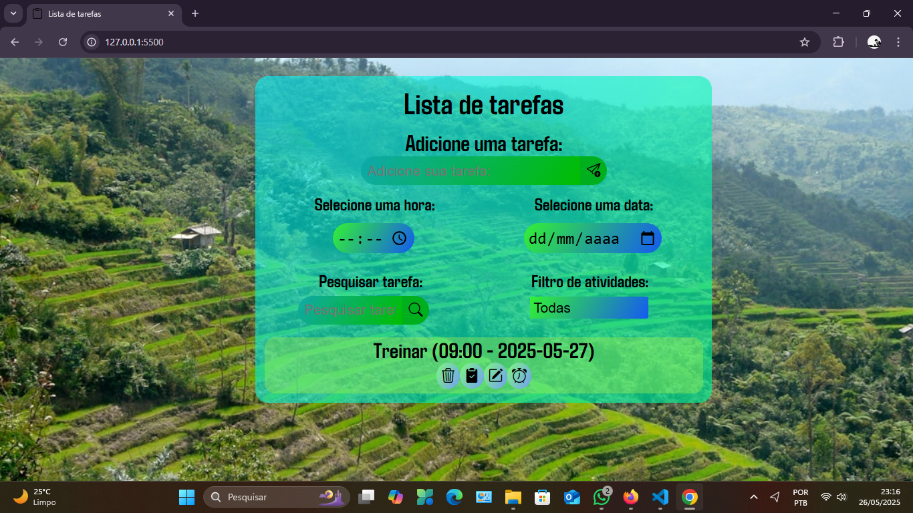

Lista de Tarefas

Este é um projeto de Lista de Tarefas (To-Do List) desenvolvido com TypeScript, HTML e CSS. O objetivo é permitir que o usuário adicione, visualize e remova tarefas, com persistência de dados utilizando o localStorage.

Funcionalidades

Adicionar uma nova tarefa com título, data e hora.

Exibir a lista de tarefas salvas.

Remover tarefas individualmente.

# 📝 Lista de Tarefas (To-Do List)

Este é um projeto simples e funcional de **Lista de Tarefas (To-Do List)** desenvolvido com **TypeScript**, **HTML5** e **CSS3**. O objetivo é proporcionar ao usuário uma interface amigável e responsiva para gerenciar suas tarefas diárias, com persistência dos dados no **localStorage** para garantir que as informações sejam mantidas mesmo após o recarregamento da página.

---

## 📌 Funcionalidades

- ✅ Adicionar nova tarefa com título, data e hora
- ✅ Exibir a lista de tarefas salvas
- ✅ Remover tarefas individualmente
- ✅ Persistência automática dos dados no localStorage
- ✅ Interface responsiva e intuitiva para todos os dispositivos

---

## 🧪 Tecnologias Utilizadas

| Ferramenta | Descrição |
|------------|-----------|
| [TypeScript](https://www.typescriptlang.org/) | Tipagem estática para maior robustez |
| [HTML5](https://developer.mozilla.org/pt-BR/docs/Web/HTML) | Estruturação semântica da página |
| [CSS3](https://developer.mozilla.org/pt-BR/docs/Web/CSS) | Estilização e responsividade da interface |

---

## 🖼️ Layout

> 💻 Desktop | 📱 Mobile  

| Desktop             | Mobile              |
|---------------------|---------------------|
<div align="center">   </div>


---

## 🚀 Como Executar o Projeto

1. **Clone o repositório**
   ```bash
   git clone https://github.com/seu-usuario/nome-do-repositorio.git
   cd nome-do-repositorio
   ```

2. **Abra o arquivo `index.html` no seu navegador**
   - Você poderá interagir com a aplicação e testar todas as funcionalidades.

---

## 🔒 Validação de Entradas

- Impede a adição de tarefas com campos vazios.
- Permite agendar a tarefa com data e hora específicas.
- Exibe todas as tarefas salvas, mesmo após fechar e reabrir o navegador.

---

## 🔄 Melhorias Futuras

- 🔨 Adicionar opção para **editar tarefas existentes**.
- 🔨 Implementar **categorias ou etiquetas** para facilitar a organização das tarefas.
- 🔨 Adicionar uma opção de **ordenar** por data, prioridade ou status.

---

## 🤝 Contribuições

Contribuições são muito bem-vindas! Se você tiver ideias para melhorias, encontrar bugs ou desejar sugerir novas funcionalidades, sinta-se à vontade para abrir uma **issue** ou enviar um **pull request**. Vamos juntos deixar essa lista de tarefas ainda melhor! 🚀

---

## 🧑‍💻 Autor

Desenvolvido por: **Anathyon Erysson**  
💼 [LinkedIn](https://www.linkedin.com/in/anathyonerysson/)  
📧 anathyonerysson@protonmail.com

